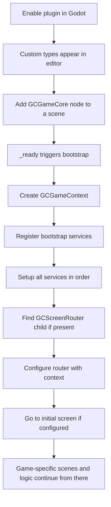
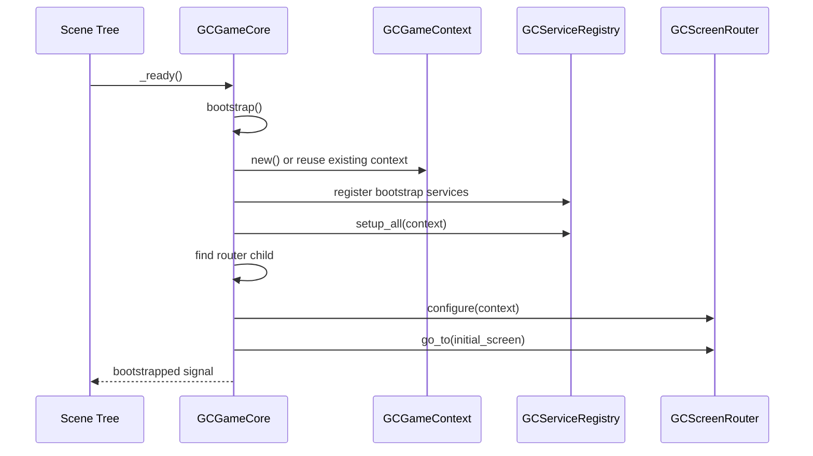
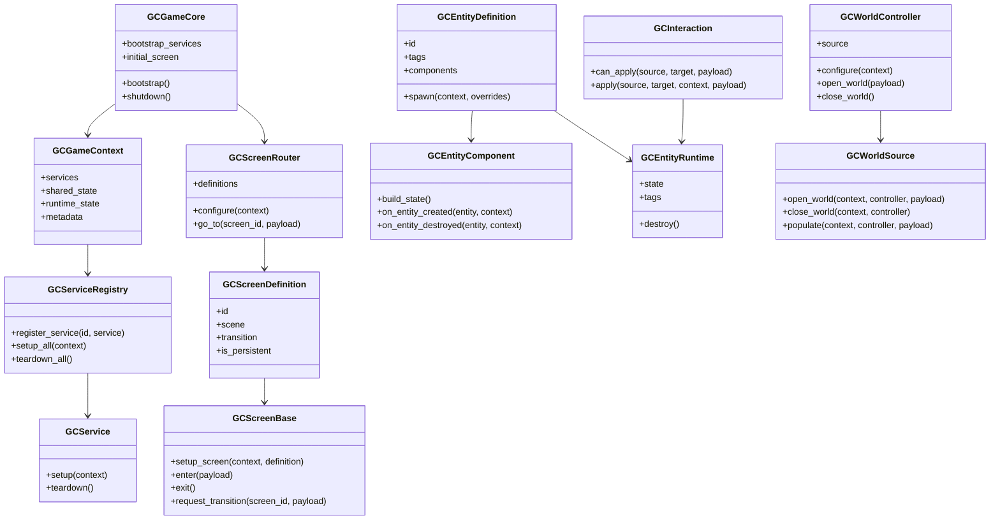

# Game Core Architecture Guide

This document explains how the current addon works today.

It is intentionally written for someone who already knows software architecture well, but is still building intuition for Godot and GDScript. The goal is to make the addon feel predictable instead of magical.

## Start here

If the code feels abstract, hold onto this mental model first:

- The addon is not a finished game framework.
- The addon is a small set of reusable contracts.
- Those contracts define where cross-project logic should live.
- Your actual game scenes and game-specific rules still live in the consuming project.

In practical terms, this addon currently gives you four reusable building blocks:

1. A boot/runtime layer.
2. A screen navigation layer.
3. An entity/component layer.
4. A world loading layer.

That is all. There is no hidden ECS, no scene generation pipeline, and no mandatory architecture outside those contracts.

## What "headless-first" means here

In this addon, "headless-first" does not mean server-only or no rendering.

It means the important game state should be able to exist outside a scene tree when practical.

Examples:

- A player or enemy can be represented by a `GCEntityRuntime` plus component resources.
- Shared game flags can live in `GCGameContext.runtime_state` or `GCGameContext.shared_state`.
- A screen transition can be requested by logical screen id instead of hard-coding scene paths all over the game.

This makes your game logic easier to move across projects because the core rules are less tied to one scene hierarchy.

## The runtime in one picture



## The important idea: what is stable vs what is game-specific

The addon should stay stable in areas that are generic across many 2D games.

Stable addon code:

- Bootstrapping.
- Shared services.
- Screen routing contracts.
- Entity definitions and component contracts.
- Generic interaction patterns.
- Generic world loading contracts.

Game-specific code that should usually stay outside the addon:

- Character controller details.
- Combat formulas that only one game needs.
- Exact enemy AI trees for one title.
- UI art and layout.
- Camera tuning.
- One-off level scripts.

If you keep that boundary clean, the addon can become a future git submodule without turning into a dump of random project code.

## How the addon enters Godot

The entry point is [plugin.cfg](/Users/abdel/Workspace/Games/2DGameCore/addons/game_core/plugin.cfg) and [plugin.gd](/Users/abdel/Workspace/Games/2DGameCore/addons/game_core/plugin/plugin.gd).

What happens there:

- Godot reads `plugin.cfg` when the plugin is enabled.
- `plugin.gd` runs as an `EditorPlugin`.
- It registers several custom script types such as `GCGameCore`, `GCScreenRouter`, `GCEntityDefinition`, and `GCWorldController`.
- That registration makes these types appear as first-class nodes/resources in the editor.

This plugin does not start the game. It only teaches the editor about the addon types.

## Layer 1: Boot and shared runtime

This layer is the backbone of the addon.

### `GCGameCore`

File: [gc_game_core.gd](/Users/abdel/Workspace/Games/2DGameCore/addons/game_core/core/gc_game_core.gd)

This is the runtime entry node.

What it owns:

- Creating or reusing a `GCGameContext`.
- Registering services listed in `bootstrap_services`.
- Calling service setup in a deterministic order.
- Finding an attached `GCScreenRouter` child.
- Starting the initial screen if `initial_screen` is configured.
- Resetting attached router state when shutting down.
- Tearing services down when the node exits the tree.

The boot sequence is simple:



How to think about it:

- `GCGameCore` is the composition root.
- If something must exist before gameplay or menus start, it likely belongs here through a service.
- If something is just a normal scene detail, it should not be forced into `GCGameCore`.

### `GCGameContext`

File: [gc_game_context.gd](/Users/abdel/Workspace/Games/2DGameCore/addons/game_core/core/gc_game_context.gd)

This is the shared runtime container.

It currently exposes:

- `services`: the `GCServiceRegistry`.
- `shared_state`: data intended to remain broadly available across screens or systems.
- `runtime_state`: general mutable runtime state.
- `metadata`: free-form extra information.

This is intentionally lightweight. Right now it behaves more like a shared session object than a full domain model.

Suggested usage:

- Put global run state here: current save slot, difficulty, unlocked features, run seed, debug flags.
- Do not dump every gameplay variable into it just because it is convenient.
- Keep ownership clear. If a system logically owns data, consider a service instead of using the context as a global bag.

### `GCServiceRegistry`

File: [gc_service_registry.gd](/Users/abdel/Workspace/Games/2DGameCore/addons/game_core/core/gc_service_registry.gd)

This is a minimal ordered service container.

What it does:

- Registers services by id.
- Preserves registration order.
- Calls `setup(context)` in registration order.
- Immediately sets up newly registered services after the registry is already running.
- Calls `teardown()` in reverse order.
- Only tears down services that were actually started.

That reverse teardown order is important. It mirrors a clean dependency shutdown pattern used in many backend systems.

Use it for systems like:

- Save system.
- Input abstraction.
- Dialogue runtime.
- Economy or progression manager.
- Audio event dispatcher.
- Debug tooling.

### `GCService`

File: [gc_service.gd](/Users/abdel/Workspace/Games/2DGameCore/addons/game_core/core/gc_service.gd)

This is a base class with two hooks:

- `setup(context)`
- `teardown()`

It is intentionally small because the addon is still early. The extension point is the subclass, not the base class.

## Layer 2: Screen flow

This layer standardizes screen navigation without dictating UI structure.

### The moving parts

- `GCScreenDefinition` says what a logical screen id means.
- `GCScreenRouter` manages active screen instances.
- `GCScreenBase` provides lifecycle hooks for actual screen scenes.
- `GCScreenTransition` controls how switching happens.

### Screen flow in one picture

```mermaid
flowchart LR
    A[GCGameCore] --> B[configure router]
    B --> C[GCScreenRouter]
    C --> D[lookup GCScreenDefinition by id]
    D --> E[instantiate screen scene]
    E --> F[screen.setup_screen(context, definition)]
    F --> G[transition.begin or immediate complete_transition]
    G --> H[current_screen.enter(payload)]
    H --> I[screen may later request_transition(next_id)]
    I --> C
```

### `GCScreenDefinition`

File: [gc_screen_definition.gd](/Users/abdel/Workspace/Games/2DGameCore/addons/game_core/screens/gc_screen_definition.gd)

This resource maps a stable screen id to:

- A `PackedScene`.
- An optional transition resource.
- A persistence policy.

The key architectural move here is that the router deals in ids, not file paths.

That matters because it gives you a stable contract like `main_menu`, `pause_menu`, `gameplay`, `inventory`, instead of scattering direct scene references everywhere.

### `GCScreenBase`

File: [gc_screen_base.gd](/Users/abdel/Workspace/Games/2DGameCore/addons/game_core/screens/gc_screen_base.gd)

This is the script your actual screen scenes should inherit.

Important hooks:

- `setup_screen(context, definition)`
- `enter(payload)`
- `exit()`
- `request_transition(screen_id, payload)`

This gives each screen a clear lifecycle.

Recommended use:

- Load local visuals in `enter`.
- Disconnect signals or stop animations in `exit`.
- Use `request_transition("gameplay")` instead of manually manipulating the parent router.

### `GCScreenRouter`

File: [gc_screen_router.gd](/Users/abdel/Workspace/Games/2DGameCore/addons/game_core/screens/gc_screen_router.gd)

This is the active screen manager.

What it does:

- Builds an internal lookup from `definitions`.
- Validates that the requested id exists.
- Reuses persistent screens when `is_persistent` is true.
- Removes and frees non-persistent screens on exit.
- Connects `transition_requested` from the current screen.
- Supports an explicit router reset so cached persistent screens do not outlive their game context.

This is not a navigation stack yet. It is a single-current-screen router.

That is an important current limitation.

If you later need stack behavior for overlays, pause menus, or back-navigation, you can extend this router or add a specialized overlay/router layer.

### `GCScreenTransition`

File: [gc_screen_transition.gd](/Users/abdel/Workspace/Games/2DGameCore/addons/game_core/screens/gc_screen_transition.gd)

Right now the default transition just completes immediately.

That means the transition resource is more important as an extension contract than as a current feature.

Future subclasses could implement:

- Fade to black.
- Slide transitions.
- Camera blend.
- Wait for async preload.
- Transition guards.

## Layer 3: Entities and components

This is the part most likely to feel abstract at first, especially if you are expecting Godot scenes to be the only unit of gameplay.

The intention is not to replace scenes. The intention is to separate archetype data and reusable behavior slices from scene composition.

### Entity pieces

- `GCEntityDefinition` is an archetype resource.
- `GCEntityComponent` is a reusable behavior/data slice.
- `GCEntityRuntime` is the live runtime instance.
- `GCInteraction` defines generic rules between entities.

### Entity lifecycle

```mermaid
flowchart TD
    A[GCEntityDefinition resource] --> B[spawn(context, overrides)]
    B --> C[Create GCEntityRuntime]
    C --> D[Copy tags and components from definition]
    D --> E[Merge component build_state into runtime.state]
    E --> F[Call each component.on_entity_created]
    F --> G[Runtime is now available to game-specific scene code]
    G --> H[Later destroy()]
    H --> I[Call components.on_entity_destroyed in reverse order]
```

### `GCEntityDefinition`

File: [gc_entity_definition.gd](/Users/abdel/Workspace/Games/2DGameCore/addons/game_core/entities/gc_entity_definition.gd)

This resource represents a reusable entity archetype.

Examples of what one definition might represent:

- `goblin_melee`
- `health_pickup_small`
- `breakable_barrel`
- `village_shopkeeper`

It stores:

- `id`
- `tags`
- `components`

Its job is very small: spawn a runtime instance from the definition.

### `GCEntityComponent`

File: [gc_entity_component.gd](/Users/abdel/Workspace/Games/2DGameCore/addons/game_core/entities/gc_entity_component.gd)

This resource is intended to be your reusable behavior slice.

Hooks:

- `build_state()` returns initial state to merge into the runtime.
- `on_entity_created(entity, context)` performs startup logic.
- `on_entity_destroyed(entity, context)` performs cleanup.

Examples of future components:

- Health component.
- Faction component.
- Loot drop table component.
- Patrol behavior config component.
- Hitbox config component.
- Ability loadout component.

### `GCEntityRuntime`

File: [gc_entity_runtime.gd](/Users/abdel/Workspace/Games/2DGameCore/addons/game_core/entities/gc_entity_runtime.gd)

This is the live headless object created from a definition.

It currently holds:

- `entity_id`
- `definition`
- `context`
- `tags`
- `state`
- `components`

The runtime is where component state ends up.

This makes it possible for a visual scene to wrap the runtime instead of being the only source of truth.

Practical example:

- A slime enemy scene can own animation, sprite, navigation agent, and hit flashes.
- The corresponding `GCEntityRuntime` can own tags, health values, status flags, and reusable behavior state.

### `GCInteraction`

File: [gc_interaction.gd](/Users/abdel/Workspace/Games/2DGameCore/addons/game_core/interactions/gc_interaction.gd)

This is a generic resource that represents something one entity can do to another, subject to tag checks.

It exposes:

- `required_source_tags`
- `required_target_tags`
- `can_apply(source, target, payload)`
- `apply(source, target, context, payload)`

Examples of future interactions:

- Damage interaction.
- Heal interaction.
- Open door interaction.
- Pick up loot interaction.
- Start dialogue interaction.

This is a useful place for reusable verbs that appear in many games.

## Layer 4: World orchestration

This layer is the abstraction point for loading the play space.

### `GCWorldController`

File: [gc_world_controller.gd](/Users/abdel/Workspace/Games/2DGameCore/addons/game_core/world/gc_world_controller.gd)

This is a node that owns world lifecycle in the scene tree.

It can:

- Accept a configured `GCWorldSource` resource.
- Receive `configure(context)`.
- Open a world with payload.
- Close the current world.

Its current lifecycle is:

1. Validate that `source` exists.
2. Validate that `context` has been assigned.
3. Close the current world if one is already open.
4. Call `source.open_world(...)`.
5. Call `source.populate(...)`.
6. Mark the world as open.

### `GCWorldSource`

File: [gc_world_source.gd](/Users/abdel/Workspace/Games/2DGameCore/addons/game_core/world/gc_world_source.gd)

This is the strategy resource for how a world is provided.

Right now it exposes three hooks:

- `open_world(context, controller, payload)`
- `close_world(context, controller)`
- `populate(context, controller, payload)`

This is deliberately flexible enough to support multiple styles later:

- Fixed level scenes.
- Sequence of rooms.
- Chunk streaming.
- Procedural generation from a seed.

## How the pieces relate



## How to work on this addon without making it worse

This section matters more than the API surface.

### Rule 1: add abstractions only when two future games will likely need them

If a mechanic is only for one project, keep it in that project.

The addon should absorb patterns, not experiments.

### Rule 2: prefer adding a new resource or service before adding a new manager node

This repo should not drift toward a forest of singleton-like nodes.

Good candidates for reusable abstractions:

- New service types.
- New component types.
- New interaction types.
- New world source implementations.
- New transition implementations.

### Rule 3: keep ids stable

These ids are integration seams:

- Service ids.
- Screen ids.
- Entity ids.

If those drift casually, larger projects become harder to reason about.

### Rule 4: avoid treating `GCGameContext` as a garbage drawer

The context is useful, but it should not become a replacement for real ownership boundaries.

When in doubt:

- Shared configuration or session flags can live in context.
- Rich behavior should usually live in a dedicated service or runtime object.

### Rule 5: keep the scene tree as an adapter, not always the source of truth

A good pattern is often:

- resource definition
- runtime object
- scene wrapper

This keeps gameplay logic portable and testable.

## Suggested development workflow

1. Add or refine a reusable contract in the addon.
2. Create a small sandbox example proving the contract is actually useful.
3. Only after that, move the pattern into a real game project.
4. If the pattern survives one game, generalize it carefully for the addon.

That loop helps prevent premature framework design.

## Example: adding a reusable service

```gdscript
extends GCService
class_name SaveGameService

var context: GCGameContext

func setup(game_context: GCGameContext) -> void:
    context = game_context
    context.set_shared_value(&"save_slot", 1)

func teardown() -> void:
    context = null
```

Then add the script to `GCGameCore.bootstrap_services`.

That gives you a clean startup-managed service without needing an autoload.

## Example: adding a reusable entity component

```gdscript
extends GCEntityComponent
class_name ArmorComponent

@export var armor := 2

func build_state() -> Dictionary:
    return {
        &"armor": armor,
    }
```

Now any `GCEntityDefinition` can compose this component.

## Current limitations

These are not bugs. They are simply the current maturity level of the addon.

- No save/load system yet.
- No navigation stack or overlay router yet.
- No built-in registry for spawned entity runtimes yet.
- No built-in scene wrapper pattern for entity runtime plus visuals yet.
- No chunk streaming implementation yet.
- No contract tests yet.

## Recommended next improvements

If you want to evolve the addon in a disciplined order, this is the order I would recommend:

1. Add a real example scene tree in `sandbox_tests` using `GCGameCore` and `GCScreenRouter`.
2. Add one concrete `GCWorldSource` implementation for a fixed level flow.
3. Add one concrete `GCInteraction` such as damage or pickup.
4. Add a save service and serialization strategy.
5. Add an entity runtime registry so systems can query spawned entities cleanly.
6. Add tests or at least sandbox verification scenes for each contract.

## Read next

For a file-by-file explanation of every current addon script, read [file_reference.md](/Users/abdel/Workspace/Games/2DGameCore/addons/game_core/docs/file_reference.md).
