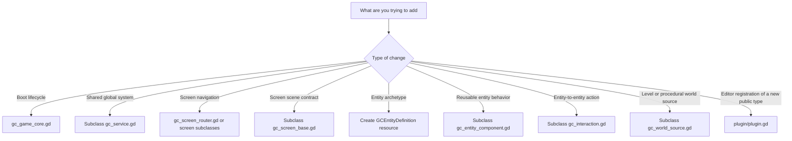

# Game Core File Reference

This document explains every current file in the addon and how you should think about editing it.

## Plugin entry points

### [addons/game_core/plugin.cfg](/Users/abdel/Workspace/Games/2DGameCore/addons/game_core/plugin.cfg)

Purpose:

- Declares the addon to Godot.

Edit this when:

- You change plugin metadata.
- You rename the plugin script path.

Do not edit this when:

- You are adding runtime features. Those belong in normal `.gd` files, not here.

### [addons/game_core/plugin/plugin.gd](/Users/abdel/Workspace/Games/2DGameCore/addons/game_core/plugin/plugin.gd)

Purpose:

- Registers custom node/resource types in the editor.

You edit this when:

- You add a new reusable public addon type that should appear in the Godot editor.

You usually do not edit this when:

- You are changing runtime behavior.

Risk if misused:

- The addon may still work at runtime, but the editor will not expose your new types properly.

## Core runtime files

### [addons/game_core/core/gc_game_core.gd](/Users/abdel/Workspace/Games/2DGameCore/addons/game_core/core/gc_game_core.gd)

Purpose:

- Runtime bootstrap node.
- Preserves pre-bootstrap service registration and coordinates router cleanup on shutdown.

Key exports:

- `bootstrap_services`
- `initial_screen`
- `auto_bootstrap`

Touch this file when:

- You are changing how the addon boots.
- You need a new core lifecycle hook.

Be careful because:

- This is one of the most central files in the entire addon.
- Small changes here affect all games using the core.

### [addons/game_core/core/gc_game_context.gd](/Users/abdel/Workspace/Games/2DGameCore/addons/game_core/core/gc_game_context.gd)

Purpose:

- Shared runtime container.

Touch this file when:

- You want to add a broadly reusable context capability.

Avoid adding:

- Game-specific state fields.
- A large pile of unrelated helper methods.

### [addons/game_core/core/gc_service_registry.gd](/Users/abdel/Workspace/Games/2DGameCore/addons/game_core/core/gc_service_registry.gd)

Purpose:

- Ordered registration, setup, lookup, and teardown of services.
- Supports late registration after setup and deterministic replacement behavior.

Touch this file when:

- You need richer service lifecycle or lookup behavior.

Possible future improvements:

- Dependency declarations.
- Lazy initialization.
- Failure rollback when a service setup step raises errors.

### [addons/game_core/core/gc_service.gd](/Users/abdel/Workspace/Games/2DGameCore/addons/game_core/core/gc_service.gd)

Purpose:

- Base class for reusable cross-cutting systems.

Touch this file when:

- You want to add a lifecycle contract shared by all services.

Do not overload it with:

- Project-specific assumptions.

## Screen flow files

### [addons/game_core/screens/gc_screen_base.gd](/Users/abdel/Workspace/Games/2DGameCore/addons/game_core/screens/gc_screen_base.gd)

Purpose:

- Base class for actual screen scenes.

Use it by:

- Creating a screen scene.
- Attaching a script that extends `GCScreenBase`.
- Implementing `enter` and `exit`.

### [addons/game_core/screens/gc_screen_definition.gd](/Users/abdel/Workspace/Games/2DGameCore/addons/game_core/screens/gc_screen_definition.gd)

Purpose:

- Resource mapping from logical screen id to a concrete scene.

Use it by:

- Creating a resource per screen.
- Filling in the `id`, `scene`, and optional `transition`.

### [addons/game_core/screens/gc_screen_router.gd](/Users/abdel/Workspace/Games/2DGameCore/addons/game_core/screens/gc_screen_router.gd)

Purpose:

- Manages the currently active screen.

Use it by:

- Adding it as a child of `GCGameCore`.
- Assigning `definitions` in the inspector.
- Setting `GCGameCore.initial_screen` to one of those ids.

Current limitation:

- Only one active screen at a time.

Operational note:

- `reset_router()` clears the current screen and cached persistent instances so a new `GCGameContext` does not reuse stale screen objects.

### [addons/game_core/screens/gc_screen_transition.gd](/Users/abdel/Workspace/Games/2DGameCore/addons/game_core/screens/gc_screen_transition.gd)

Purpose:

- Transition strategy contract.

Use it by:

- Subclassing it when you want non-trivial screen transitions.

## Entity and interaction files

### [addons/game_core/entities/gc_entity_definition.gd](/Users/abdel/Workspace/Games/2DGameCore/addons/game_core/entities/gc_entity_definition.gd)

Purpose:

- Resource describing an entity archetype.

Use it by:

- Creating a definition resource.
- Assigning tags and components.
- Spawning a runtime from it.

### [addons/game_core/entities/gc_entity_component.gd](/Users/abdel/Workspace/Games/2DGameCore/addons/game_core/entities/gc_entity_component.gd)

Purpose:

- Reusable behavior/data slice for entities.

Use it by:

- Creating subclasses for health, loot, faction, status effects, and similar reusable concerns.

### [addons/game_core/entities/gc_entity_runtime.gd](/Users/abdel/Workspace/Games/2DGameCore/addons/game_core/entities/gc_entity_runtime.gd)

Purpose:

- Live runtime object created from a definition.

Touch this file when:

- You need more runtime capabilities shared by all entity instances.

Examples:

- Event bus helpers.
- Query helpers.
- State mutation utilities.

### [addons/game_core/interactions/gc_interaction.gd](/Users/abdel/Workspace/Games/2DGameCore/addons/game_core/interactions/gc_interaction.gd)

Purpose:

- Generic reusable interaction rule.

Use it by:

- Subclassing for actions that one entity performs on another.

Good fit:

- Damage.
- Healing.
- Pickup.
- Trigger dialogue.

Bad fit:

- Deep one-off boss logic that only one game will ever use.

## World files

### [addons/game_core/world/gc_world_controller.gd](/Users/abdel/Workspace/Games/2DGameCore/addons/game_core/world/gc_world_controller.gd)

Purpose:

- Scene-tree owner for opening and closing worlds.

Use it by:

- Adding it where your game scene needs world orchestration.
- Assigning a `GCWorldSource` resource.
- Calling `configure(context)` before `open_world(...)`.

### [addons/game_core/world/gc_world_source.gd](/Users/abdel/Workspace/Games/2DGameCore/addons/game_core/world/gc_world_source.gd)

Purpose:

- Strategy resource that describes where the playable world comes from.

Use it by:

- Subclassing it for fixed levels, rooms, chunk streaming, or procedural generation.

## Sandbox files

### [sandbox_tests/demo_logging_service.gd](/Users/abdel/Workspace/Games/2DGameCore/sandbox_tests/demo_logging_service.gd)

Purpose:

- Minimal example service showing setup and teardown.

Use it for:

- Understanding the service lifecycle.

### [sandbox_tests/demo_health_component.gd](/Users/abdel/Workspace/Games/2DGameCore/sandbox_tests/demo_health_component.gd)

Purpose:

- Minimal example component showing initial runtime state creation.

Use it for:

- Understanding how component state is merged into entity runtime state.

## Which file should I edit for a given goal?

## Safe extension checklist

- Ask whether the behavior is truly reusable across future games.
- Prefer adding a subclass before modifying a core base file.
- Keep public ids stable.
- Add a sandbox example for any new abstraction.
- Avoid pulling genre-specific details into the addon too early.
